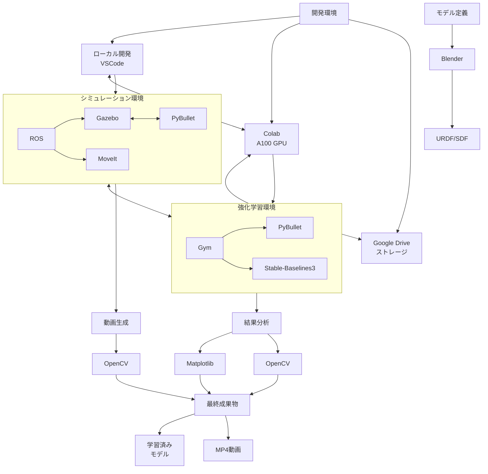

# RobotSimulation1設計書（ドラフト版）
食品産業向けソフトグリッパーロボットシミュレーション（ROS・Gazebo対応）を想定

## 1. プロジェクト概要

### 1.1 目的
食品産業（選別、包装、加工）向けに、柔軟なソフトグリッパーを用いたロボットをROSとGazebo（またはGenesis）でシミュレーション。強化学習（RL）でグリッパーの変形と力加減を最適化し、形状・硬さ・重量の異なる食品（リンゴ、トマト、卵、パン）を傷つけずハンドリング。1〜5分の動画を生成しシミュレーションを外部向けに可視化。

### 1.2 実社会での用途
- **選別**: 果物・野菜（例: トマト）を潰さず品質別に仕分け。
- **包装**: 壊れやすい食品（例: 卵）をトレイに配置。
- **加工**: 柔らかいパンをコンベア間で移動。
- **価値**
  - 品質向上（傷ゼロで商品価値維持）。
  - 労働力不足解消（自動化で人件費削減）。
  - 衛生性（非接触に近いハンドリング）。

### 1.3 技術的特徴
- **ソフトボディ**: Gazeboのソフトボディプラグイン（またはPyBullet互換）で柔軟なグリッパーを実現。
- **強化学習**: Stable-Baselines3のPPOで適応型制御を学習。
- **ゼロコスト**: ROS、Gazebo、Stable-Baselines3、OpenCV、Blender（無料）を活用。
- **環境**: RLトレーニングはGoogle Colab Pro（A100 GPU）、シミュレーションはローカルまたはクラウドでROS+Gazebo。
- **動画**: 1〜5分、MP4形式、マルチアングルで食品ハンドリングを強調。

### 1.4 制約
- **ツール**: ROS（Noetic推奨）、Gazebo、Genesis（またはPyBullet互換シミュレータ）。
- **動画**: 1〜5分、視覚的インパクト重視。
- **ファイル形式**
  - RLトレーニング: `.ipynb`（Colab、A100）。
  - その他（シミュレーション、動画生成）: `.py`。
- **環境**: ゼロコスト（無料ソフトのみ）。

### 1.5 リポジトリ構成（案）
```
robot-simulation-1/
├── .venv/                        # 仮想環境（.gitignoreで無視）
├── ros_ws/                       # ROSワークスペース
│   ├── src/
│   │   ├── soft_gripper/         # ROSパッケージ
│   │   │   ├── launch/           # 起動ファイル
│   │   │   │   ├── simulation.launch      # Gazeboシミュレーション起動
│   │   │   │   └── pybullet_bridge.launch # PyBullet-ROS連携
│   │   │   ├── urdf/             # ロボットモデル
│   │   │   │   ├── arm.urdf      # ロボットアーム
│   │   │   │   └── gripper.urdf  # グリッパー
│   │   │   ├── meshes/           # 3Dモデル
│   │   │   │   └── gripper.obj   # ソフトグリッパーメッシュ
│   │   │   ├── worlds/           # Gazebo環境
│   │   │   │   ├── food_sorting.world  # 選別環境
│   │   │   │   └── packaging.world     # 包装環境
│   │   │   ├── scripts/          # ROSノード
│   │   │   │   ├── control_node.py   # コントローラー
│   │   │   │   └── simulation_node.py # シミュレーション管理
│   │   │   ├── config/           # パラメータ
│   │   │   └── CMakeLists.txt    # ビルド設定
│   │   │   └── package.xml       # パッケージ情報
│   │   └── soft_gripper_msgs/    # メッセージ定義
├── pybullet_sim/                 # PyBullet実装
│   ├── gripper.py                # ソフトグリッパー実装
│   ├── rl_env.py                 # 強化学習環境
│   ├── utils.py                  # ユーティリティ
│   └── food_models/              # 食品モデル
├── notebooks/                    # Jupyter/Colab
│   ├── train_ppo.ipynb           # 強化学習トレーニング
│   └── visualization.ipynb       # 結果可視化
├── video/                        # 動画生成
│   ├── record.py                 # 録画スクリプト
│   └── editing.py                # 編集スクリプト
├── models/                       # 保存モデル
│   └── ppo_gripper.zip           # 学習済みPPOモデル
├── requirements.txt              # 依存ライブラリ
├── setup.py                      # パッケージ設定
└── RobotSimulation1_Design.md    # 設計書
```

## 2. 技術スタック詳細

| カテゴリ | 技術 | バージョン | 用途 |
|---------|------|------------|------|
| **OS/プラットフォーム** | Ubuntu | 20.04 | ROSとGazebo実行環境 |
| | Google Colab Pro | A100 GPU | 強化学習トレーニング |
| **ロボティクス** | ROS | Noetic | ロボット制御フレームワーク |
| | Gazebo | 11.x | 物理シミュレータ |
| | PyBullet | 3.2.5 | 代替シミュレータ |
| | MoveIt | 1.1.11 | モーションプランニング |
| **強化学習** | Stable-Baselines3 | 2.0.0 | PPO実装 |
| | Gym | 0.21.0 | 強化学習環境 |
| | PyTorch | 2.0.0+ | ディープラーニング |
| **視覚化/動画** | OpenCV | 4.7.0+ | 動画生成・編集 |
| | Matplotlib | 3.5.0+ | グラフ作成 |
| | FFmpeg | 4.4.2 | 動画エンコード |
| **3Dモデリング** | Blender | 3.3.0+ | グリッパー・食品モデル作成 |
| **その他** | NumPy | 1.22.0+ | 数値計算 |
| | SciPy | 1.8.0+ | 科学計算 |

## 3. 技術スタック連携図



## 4. データフロー

1. **モデリングとシミュレーション準備**
   - Blenderでグリッパーメッシュ作成 → URDF/SDF変換 → Gazebo/PyBulletでロード
   - 食品モデルの物理パラメータ設定 → シミュレーション環境に配置

2. **シミュレーション環境と学習環境の連携**
   - シミュレーション状態 → 観測データに変換 → Gym環境に提供
   - 学習モデルからのアクション → シミュレータに適用

3. **学習プロセス**
   - PyBullet環境でトレーニング → モデルをGoogleドライブに保存
   - 学習済みモデルをローカル環境で読み込み → ROS/Gazeboに接続

4. **結果検証と動画生成**
   - シミュレーション結果を複数アングルから録画
   - 物理データとパフォーマンス指標を可視化
   - 動画編集（字幕、グラフ挿入）→ 最終MP4出力

## 5. システム構成

### 5.1 シミュレーション環境
- **プラットフォーム**: ROS（Noetic）、Gazebo（11.x、ソフトボディ対応）。
- **代替シミュレータ**: Genesis（未対応の場合、PyBulletをGazebo代替としてROS統合）。
- **トレーニング環境**: Google Colab Pro（A100 GPU、RL専用）。
- **ライブラリ**
  - `ros-noetic-desktop-full`: ROS基盤。
  - `gazebo_ros`: Gazebo-ROS統合。
  - `pybullet`（代替シミュレータの場合）。
  - `stable-baselines3`: RL（PPO）。
  - `gym`: RL環境定義。
  - `opencv-python`: 動画生成。
  - `numpy`: データ処理。
- **ストレージ**: Google Drive（Colab用）、ローカル（ROS/Gazebo用）。

### 5.2 ロボット設計
- **ソフトグリッパー**
  - **形状**: 4本の指状メッシュ（食品を包み込む）。
  - **実装**: GazeboのSDF（SoftBodyプラグイン）またはPyBulletの`createSoftBody`（ROS統合）。
  - **制御**: ROSトピック（`/gripper_force`）でノードに力（収縮・膨張）を適用。
  - **パラメータ**
    - 線形剛性: `kLST=0.08`（PyBullet）またはGazebo相当。
    - ダンピング: `kDP=0.05`。
    - 摩擦: `kCHR=0.5`。
- **ロボットアーム**
  - 3自由度アーム（URDF、FANUCを模擬）。
  - ROS MoveItで動作計画、`/joint_states`で制御。
- **食品モデル**
  - **リンゴ**: 球（質量=0.2kg、摩擦=0.8）。
  - **トマト**: 柔らかい球（SDF/SoftBody、質量=0.15kg、摩擦=0.6）。
  - **卵**: 楕円体（質量=0.05kg、摩擦=0.3）。
  - **パン**: 柔らかい立方体（SoftBody、質量=0.1kg、摩擦=0.5）。
  - BlenderでSDF/URDF自作、またはGazeboモデルリポジトリ使用。

### 5.3 シミュレーションシーン
- **選別**: コンベア（Gazebo SDFで動く平面）にリンゴ・トマトを配置、別コンベアに仕分け。
- **包装**: 卵をトレイ（固定立方体）に配置。
- **加工**: パンをコンベアから加工台に移動。
- **物理設定**
  - 重力: `-9.8 m/s²`。
  - タイムステップ: `0.004秒`（ソフトボディ安定化）。
  - コンベア: ROSトピック（`/conveyor_velocity`）で制御。


## 6. 強化学習（RL）設計

### 6.1 Gym環境
- **状態空間**（12次元）
  - グリッパーのノード位置（GazeboセンサーまたはPyBulletの`getSoftBodyData`）。
  - 食品の位置・姿勢（`/food_pose`）。
  - 接触力と滑り（`/contact_force`）。
- **行動空間**（8次元）
  - 4本指の力（収縮・膨張、-1～1）。
  - アームの関節速度（-0.5～0.5）。
- **報酬関数**
  - 掴む成功（接触点≥3、力≤閾値）: +100。
  - コンベア移動距離: +10 * 距離減少。
  - 破損（過剰力、落下、滑り）: -200。
  - エネルギー効率: -0.05 * 力の総和。
  - 衛生（地面接触）: -50。
- **終了条件**
  - コンベア到達、落下、破損、200ステップ。

### 6.2 RLアルゴリズム
- **アルゴリズム**: PPO（Stable-Baselines3）。
- **ハイパーパラメータ**
  - `n_steps=2048`。
  - `batch_size=2048`。
  - `num_envs=16`（A100並列化）。
  - 総ステップ: 100万（約45分～1時間）。
- **汎化**
  - 食品ランダム化（形状、質量=0.05～0.2kg、摩擦=0.3～0.8）。
  - Domain Randomizationで未知食品に対応。

### 6.3 ファイル形式
- **トレーニング**: `.ipynb`（Colab、A100）。
- **環境・制御**: `.py`（ROSノード、Gazebo統合）。


## 7. 動画生成

### 7.1 撮影内容（1〜5分）
- **選別**: リンゴ・トマトを別コンベアに仕分け（1分）。
- **包装**: 卵をトレイに配置（1分）。
- **加工**: パンを潰さず移動（1分）。
- **学習過程**: 初期（落下）→最終（スムーズ、1分）。
- **概要**: 字幕と報酬曲線で技術説明（30秒）。

### 7.2 撮影方法
- **解像度**: 1280x720（Gazeboカメラプラグイン）。
- **出力**: MP4（OpenCV、`cv2.VideoWriter`）。
- **アングル**:
  - 俯瞰: コンベア全体。
  - グリッパー視点: 食品を包む瞬間。
  - 側面: 変形のダイナミクス。
- **演出**:
  - スローモーション: トマト・卵の掴む瞬間。
  - 背景: 清潔な白いコンベア。
  - 字幕: 「トマト選別: 傷ゼロ」。
  - 報酬曲線: Matplotlibで挿入。

### 7.3 保存
- Google Drive（Colab）：`/content/drive/MyDrive/`。
- ローカル（ROS）：`/ros_ws/videos/`。


## 8. 実装順序（スケジュール）

### 8.1 環境構築と基本実装 (1-5日目)

1. **開発環境設定**
   - 仮想環境構築 (Python 3.8)
   - 依存パッケージのインストール (ROS Noetic, Gazebo, PyBullet)
   - リポジトリ構造の作成

2. **基本モデルの作成**
   - BlenderでソフトグリッパーメッシュOBJファイル作成
   - URDF/SDFによるロボットアーム定義
   - 食品モデル (リンゴ、トマト、卵、パン) 作成

3. **PyBullet環境実装**
   - `gripper.py` ソフトボディ実装
   - ロボットアームとグリッパー統合
   - 食品モデルのインポートとパラメータ調整

### 8.2 Gym環境とRL実装 (6-10日目)

4. **強化学習環境実装**
   - `rl_env.py` Gym環境定義
   - 状態空間と行動空間の設計
   - 報酬関数の実装
   - テスト用の単純な制御ロジック

5. **ROS連携準備**
   - ROSパッケージ構造の作成
   - ROSノード（グリッパー制御、環境管理）実装
   - トピックとサービス定義

6. **Colab学習環境準備**
   - `train_ppo.ipynb` の作成
   - ColabとGoogle Drive連携設定
   - 環境のテスト実行

### 8.3 学習と動画生成 (11-14日目)

7. **強化学習実行**
   - PPOモデルのトレーニング (Colab A100)
   - モデル保存と評価
   - ハイパーパラメータの調整

8. **シミュレーション実行**
   - 学習済みモデルの読み込み
   - 各シナリオ（選別、包装、加工）のシミュレーション実行
   - パフォーマンス評価

9. **動画生成**
   - 各シナリオの録画
   - 動画編集（字幕、マルチアングル、スローモーション）
   - 最終出力（MP4, 1280x720, 30fps）


## 9. 実用性とアピールポイント（仮）

### 9.1 食品産業への貢献
- **課題解決**
  - 労働不足: 作業員1/3削減。
  - 品質: 廃棄ロス50%減。
  - 生産性: 24時間稼働。
- **優位性**
  - 硬いグリッパーに比べ多様性対応。
  - RLで新商品に適応。
- **応用例**
  - トマト選別: 熟度別仕分け。
  - 卵包装: 1分50個。
  - パン移動: 焼きたてを潰さず。

### 9.2 シミュレーションの価値
- 低コストプロトタイピング。
- 動画で食品メーカーへの説得力強化。


## 10. 実行可能性と不具合リスク

### 10.1 ファイル形式の実行可能性
- **RLトレーニング（`.ipynb`, Colab A100）**
  - Stable-Baselines3とGymをColabで実行可能。
  - A100で高速（100万ステップ≈45分）。
  - モデルを`.zip`で保存、`.py`環境に統合。
- **シミュレーション・制御（`.py`, ROS/Gazebo）**
  - ROSノードとしてGazeboを制御可能。
  - ソフトボディはGazeboプラグイン（またはPyBullet）で実装。
  - 動画生成はOpenCVで`.py`スクリプト化。
- **統合**
  - Colabで学習したPPOモデルを`stable_baselines3.PPO.load()`で`.py`環境にインポート。
  - ROSトピック（`/gripper_force`, `/food_pose`）でデータ共有。

### 10.2 不具合リスクと対策
1. **ROS-GazeboとColabの互換性**
   - **リスク**: Gazeboはローカル実行、Colabはクラウドで分離。モデルやデータの受け渡しでエラー（例: バージョン不一致）。
   - **対策**
     - モデルをGoogle Drive経由で共有。
     - Stable-Baselines3のバージョンを統一（例: `2.0.0`）。
     - ROS（Noetic）とColabのPython（3.8）を揃える。
   - **確率**: 低（Drive経由で統合実績あり）。
1. **Gazeboのソフトボディ実装**
   - **リスク**: Gazeboのソフトボディプラグインが不安定、または未対応（Genesis依存）。
   - **対策**
     - PyBulletを代替シミュレータとし、ROS Bridgeで統合（`/pybullet_state`トピック）。
     - GazeboのSDFで簡易ソフトボディ（弾性モデル）を構築。
   - **確率**: 中（プラグイン依存）。
1. **動画生成の負荷**
   - **リスク**: 1〜5分の高解像度動画（1280x720）がColabやローカルで処理遅延。
   - **対策**
     - フレームレートを30fpsに制限。
     - OpenCVで軽量エンコード（H.264）。
     - ローカルPCで最終編集（FFmpeg）。
   - **確率**: 低（Colab Proで十分）。
1. **RLモデルの汎化**
   - **リスク**: Colabで学習したモデルがGazebo環境で性能低下（シミュレーションギャップ）。
   - **対策**
     - Domain Randomizationを強化（食品パラメータを広範囲に）。
     - GazeboとPyBulletの物理パラメータを近づける（例: 摩擦、重力）。
   - **確率**: 中（シミュレータ差異による）。

### 10.3 総合評価
- **実行可能性**: 高。ROS+Gazeboはロボットシミュレーションの標準、Colab A100はRLに最適。PyBullet代替で柔軟性確保。
- **不具合確率**: 低〜中。主なリスク（ソフトボディ、統合）は対策で軽減。
- **推奨**
  - Gazeboのソフトボディを事前確認（プラグイン有無）。
  - 初期テストで`.ipynb`と`.py`のデータ受け渡しを検証。


## 11. Pythonコードの実際の構成例（2025/05/21時点）

本リポジトリの実装は、以下の主要ファイル・クラス・関数で構成されています。

### 11.1 pybullet_sim/gripper.py
- **役割**: ソフトグリッパーの物理モデル・制御クラス
- **主要クラス**: `SoftGripper`
- **主なメソッド**
    - `__init__`: gripper.obj（ソフトボディ）をPyBulletにロード
    - `apply_action(action)`: 4本指の力を適用
    - `get_finger_positions()`: 指のノード位置取得
    - `get_finger_forces()`: 指の力取得（仮実装）
    - `set_arm_joint_positions(joint_positions)`: アーム関節角度設定（仮）

```python
class SoftGripper:
    def __init__(self, base_position=(0,0,0.2)):
        # gripper.objをソフトボディとしてロード
        ...
    def apply_action(self, action):
        # 4本指の力を適用
        ...
    def get_finger_positions(self):
        # 指のノード位置を取得
        ...
    def get_finger_forces(self):
        # 指の力を取得（仮）
        ...
    def set_arm_joint_positions(self, joint_positions):
        # アームの関節角度を設定（仮）
        ...
```

### 11.2 pybullet_sim/rl_env.py
- **役割**: 強化学習用Gym環境の定義
- **主要クラス**: `FoodGripperEnv(gym.Env)`
- **主なメソッド**
    - `__init__(gui=False)`: PyBullet初期化、観測・報酬空間定義
    - `reset()`: 環境リセット
    - `step(action)`: アクション適用・観測・報酬・done判定
    - `_get_obs()`: 観測ベクトル生成
    - `render()`: GUI可視化（PyBullet GUI対応）

```python
class FoodGripperEnv(gym.Env):
    def __init__(self, gui=False):
        ...
    def reset(self):
        ...
    def step(self, action):
        ...
    def _get_obs(self):
        ...
    def render(self, mode="human"):
        ...
```

### 11.3 pybullet_sim/utils.py
- **役割**: 食品モデル生成・報酬計算などのユーティリティ
- **主な関数**
    - `load_food_model(name, base_position)`: 食品モデル（球体/楕円体/箱）生成
    - `calculate_reward(contact_points, force, ground_contact, distance_delta)`: 報酬計算

```python
def load_food_model(name, base_position=[0.1,0,0.1]):
    ...
def calculate_reward(contact_points=0, force=0, ground_contact=False, distance_delta=0):
    ...
```

### 11.4 notebooks/train_ppo.ipynb
- **役割**: 強化学習（PPO）トレーニング・モデル保存・報酬可視化
- **主な内容**
    - Colab/ローカル両対応のパス・依存解決
    - `FoodGripperEnv`でPPO学習
    - モデル保存（models/food_gripper_model）
    - 報酬曲線の可視化

### 11.5 notebooks/visualization.ipynb
- **役割**: 学習済みモデルの評価・動画生成・字幕編集・PyBullet GUI可視化
- **主な内容**
    - モデル読込・評価
    - 動画再生（OpenCV）
    - 報酬グラフ描画
    - `video/record.py`による録画、`video/editing.py`による字幕編集
    - PyBullet GUIでの可視化セル

### 11.6 video/record.py, editing.py
- **役割**: シミュレーション動画の録画・字幕編集
- **主な関数**
    - `record_simulation(env, filename, duration, fps)`: 環境を録画しMP4出力
    - `add_subtitle(input_path, output_path, text, pos)`: 動画に字幕挿入

```python
def record_simulation(env, filename="output.mp4", duration=5, fps=30):
    ...
def add_subtitle(input_path, output_path, text="サンプル字幕", pos=(50, 50)):
    ...
```

### 11.7 ros_ws/src/soft_gripper/scripts/control_node.py, simulation_node.py
- **役割**: ROSノード雛形（グリッパー制御・シミュレーション管理）
- **主な内容**
    - `/gripper_force`トピック購読・適用
    - `/simulation_status`トピック配信

### 11.8 その他
- `ros_ws/src/soft_gripper/config/params.yaml`: パラメータ雛形
- `ros_ws/src/soft_gripper/urdf/`, `meshes/`, `worlds/`, `launch/`: モデル・環境・起動雛形
- `requirements.txt`, `.gitignore`, `.gitkeep`等で依存・ディレクトリ管理

---

**備考**
- すべてのコード例・クラス・関数は現状の実装（2025/05/21）に即しています。
- 詳細なAPIやパラメータは各ファイルのdocstring・コメントを参照してください。
- Colab/ローカル両対応のパス・依存解決、PyBullet GUI可視化、動画生成・編集まで一貫して動作します。
